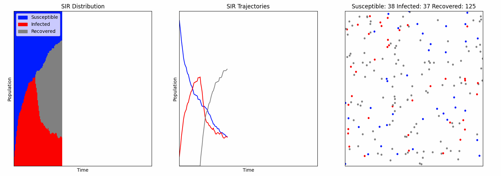
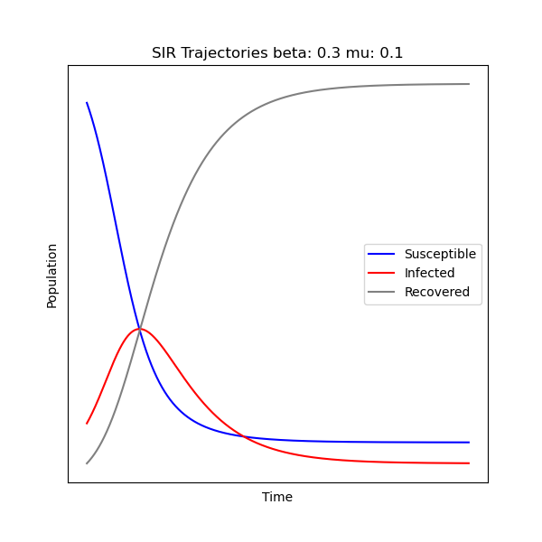

# Infectious Disease Simulation with a SIR Model

# Project Description

Susceptible-Infected-Recovered (SIR) model simulator. The model can be described in terms of ordinary differential equations (ODEs) as follows:

$$
\frac{dS}{dt} = - \beta S I ,
$$

$$
\frac{dI}{dt} = \beta S I - \mu I ,
$$

$$
\frac{dR}{dt} = \mu I,
$$

where $\beta$ and $\mu$ are the infection rate and recovery rate, respectively.

The `simple_SIR_plot.py` file generates a plot of the trajcetories produced for each of the S,I,R states by solving the ODEs describing the model:

The `runsim.py` file runs a simulation of particles moving according to random walks within a square; the particles change state according to the SIR model, thus simulating an infectious disease spreading through an evenly mixing population. Plots are produced throughout the simulation.

The following is the simulation produed using the example command in the next section:

# Running Simulation

To execute the simulation run the following command `./runsim.py`.

The program accepts the following optional parameter:

- `--seed [int]` the random seed used. Default: 42.
- `--N [int]` the size of the population. Default: 200.
- `--num_iter [int]` the number of time steps simulated. Default: 200.
- `--radius [float]` the size of the infection radius Default: 0.5.
- `--prob [float]` the infection rate. Default: 0.1.
- `--duration [int]` the length of infection in time steps. Default: 30.

For example, to run the simulation with a random seed of 42, 200 agents, for 200 iterations, with an infection radius of 0.5, rate of 0.1, and duration of 30 frames run the following command: `./runsim.py --seed 42 --N 200 --num_iter 200 --radius 0.5 --prob 0.1 --duration 30`.

Press p to toggle/pause/play the animation.

# Program requirements

See the `env.yml` file to get the program dependecy information.
